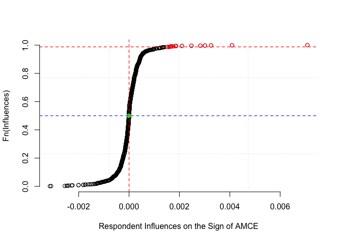

<!-- README.md is generated from README.Rmd. Please edit that file -->

# ConjointSensitivity

<!-- badges: start -->

<!-- badges: end -->

This package is developed to evaluate the robustness of conjoint
analysis results to the removal of small fractions of respondents and
experimentally generated unique contests.

For any given Average Marginal Component Effect (AMCE) estimated with
your conjoint experiment data, you can use our package to

- detect the smallest proportion of respondents (or contests) that
  derives its sign or significance,

- retrieve the set of those respondents (or contests) to further
  investigate their characteristics,

- visualize the influences of respondents (or contests) to detect
  outliers.

Our package is built on `zaminfluence` introduced by (Broderick, T.,
Giordano, R., & Meager, R., 2020) to calculate influence scores for
respondents and contests.

We provide a simple example to demonstrate how to use
`ConjointSensitivity` using the replication data for the non-partisan
YouGov experiment in Kirkland and Coppock (2018).

## References

- Broderick, T., Giordano, R., & Meager, R. (2020). *An Automatic
  Finite-Sample Robustness Metric: When Can Dropping a Little Data Make
  a Big Difference?*

- Kirkland, P. A., & Coppock, A. (2018). *Candidate choice without party
  labels: new insights from conjoint survey experiments*. Political
  Behavior, 40, 571–591.

## Citation

If you use `ConjointSensitivity` in your research, please cite our
paper:

Abramson, S., & Zafer, B. (2026) *Do Voters Prefer Women and Young
Candidates? Re-evaluating Evidence from Conjoint Experiments*

## Installation

You can install the development version of ConjointSensitivity: (Please
let us know if you encounter any error.)

``` r
# install.packages("devtools")
devtools::install_github("zfrb/ConjointSensitivity")
```

## Quickstart

This example demonstrates how to use ConjointSensitivity using the
replication data for the non-partisan YouGov experiment in Kirkland and
Coppock (2018).

``` r
library(ConjointSensitivity)
library(dplyr, quietly = T, warn.conflicts = FALSE)
library(torch)
library(purrr)

# Load the conjoint dataset
df <- read.csv("tests/testthat/testdata_KirklandCoppock_nonpartisan_yougov.csv")
df$cand_female = ifelse(df$Gender=="Female", 1, 0) # make sure the variable of interest is numeric
## Conjoint data should be in the long-form. 
```

### 1. Respondent Sensitivity

``` r
# Fit the base linear model
df$Age = as.character(df$Age)  # factor() is not allowed in formula when using AnalyzeRespondentSensitivity and AnalyzeContestSensitivity
fit.lm <- lm(
  as.formula(win ~ cand_female + Age + Race + Job + Political), 
  data = df, 
  weights = weight, 
  x = TRUE, 
  y = TRUE
)

# Run the respondent-level analysis
respondent_results <- AnalyzeRespondentSensitivity(
  fit.lm = fit.lm, 
  segroup = df$caseid,           # survey respondent id 
  var_interest = "cand_female",  # target AMCE
  target = "sign",               # or "significance"
  dropped_resp_list = TRUE       # if TRUE, function returns the set of respondent ids removed to reverse the target metric of the variable of interest. 
)

# View main results 
t(respondent_results$RespondentSensitivity)
#>              [,1]           
#> param_name   "cand_female"  
#> target       "sign"         
#> model_coef   "0.03875656"   
#> model_se     "0.01932379"   
#> model_p      "0.04707456"   
#> n_respondent "1146"         
#> total_infl   "-1.23122e-15" 
#> median_infl  "-4.175677e-06"
#> n_pos_infl   "555"          
#> n_neg_infl   "591"          
#> n_drop_auto  "16"           
#> n_drop       "14"           
#> rerun_coef   "-0.001237848" 
#> rerun_se     "0.01630143"   
#> rerun_pval   "0.9395925"    
#> reruns       "4"

# View dropped respondents  
respondent_results$DroppedRespondents
#>  [1]  845 1133 1095 1157 1109  819  306   43  932  503  630  916  517  107

print(paste0("Proportion of respondents removed to reverse the sign of cand_female:", respondent_results$RespondentSensitivity$n_drop/respondent_results$RespondentSensitivity$n_respondent*100))
#> [1] "Proportion of respondents removed to reverse the sign of cand_female:1.2216404886562"
```

#### Visualising the Respondent Influences CDF

``` r
# Respondents removed to reverse the sign of the AMCE of "cand_female" are drawn in red.
# Median respondent is shown in green.
plot_cdf_respondent_influences(fit.lm = fit.lm, 
                               segroup = df$caseid, 
                               var_interest = "cand_female", 
                               target = "sign", 
                               ndrop = 14)
```



### 2.Contest Sensitivity

``` r
contest_results <- AnalyzeContestSensitivity(
  formula = as.formula(win ~ cand_female + Age + Race + Job + Political), 
  data = as.data.frame(df), 
  respondent_id = "caseid", 
  contest_no = "contest_no",  
  var_interest = "cand_female", 
  target = "sign", 
  weights = "weight"
)

# View main results
t(contest_results$ContestSensitivity)
#>             [,1]           
#> param_name  "cand_female"  
#> target      "sign"         
#> model_coef  "0.03875656"   
#> model_se    "0.01932379"   
#> model_p     "0.04707456"   
#> total_infl  "-1.248716e-15"
#> n_contest   "2887"         
#> median_infl "-1.698448e-06"
#> n_pos_infl  "1416"         
#> n_neg_infl  "1471"         
#> n_drop_auto "23"           
#> n_drop      "22"           
#> rerun_coef  "-0.001444463" 
#> rerun_se    "0.016424"     
#> rerun_pval  "0.9300392"    
#> reruns      "3"

# View dropped contests 
contest_results$DroppedContests
#>  [1] "201-870"  "398-757"  "350-664"  "530-1246" "28-1138"  "546-1214"
#>  [7] "457-1236" "374-1035" "149-1036" "474-1135" "95-978"   "190-1012"
#> [13] "201-773"  "395-951"  "634-706"  "332-766"  "600-1322" "220-1266"
#> [19] "103-937"  "52-1001"  "134-812"  "57-954"

# View the mapping from profile attributes to contest ids.
# Note that contests are unordered pairs of profiles. 
head(contest_results$ProfileKey)
#>   profile_id                                           profile
#> 1        584       0-65-Hispanic-Attorney-SchoolBoardPresident
#> 2        552             0-65-Black-Educator-CityCouncilMember
#> 3        291 0-45-Hispanic-Stay-at-HomeDad/Mom-StateLegislator
#> 4        433       0-55-Hispanic-Electrician-CityCouncilMember
#> 5        762            1-35-Hispanic-Educator-StateLegislator
#> 6        808   1-35-White-Electrician-RepresentativeinCongress
```
